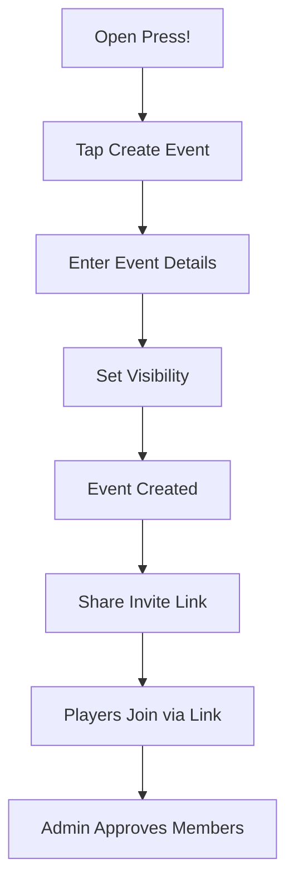
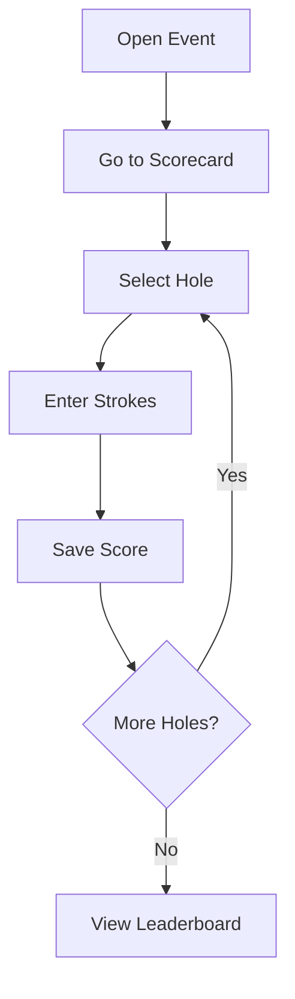
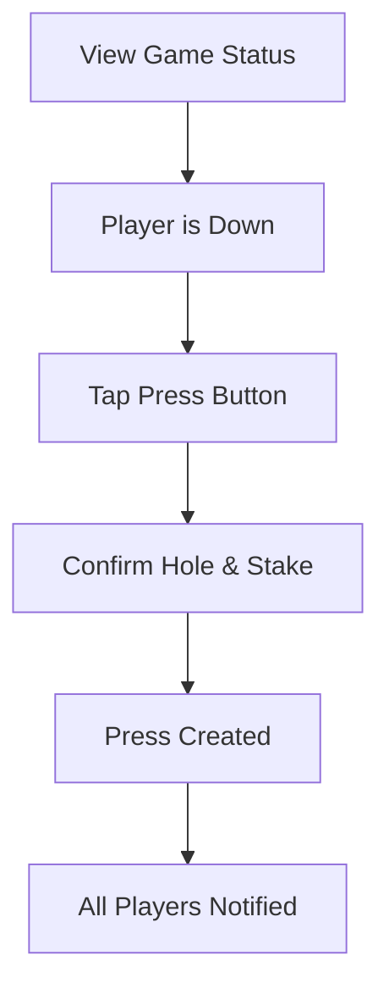
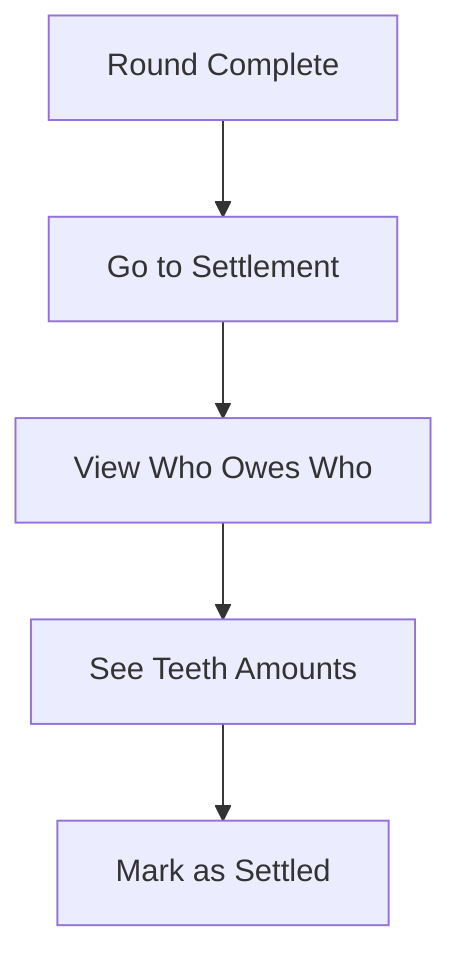
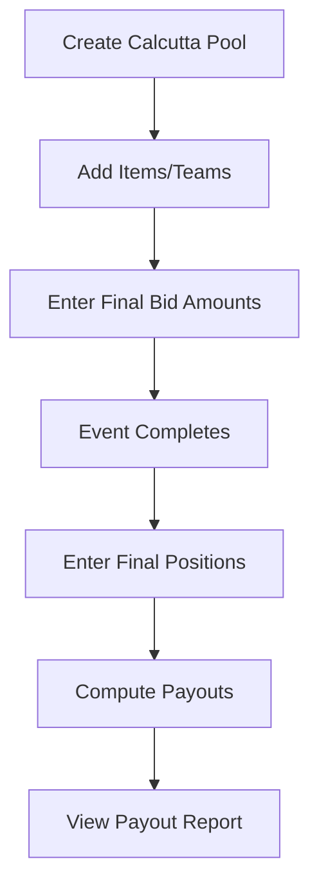
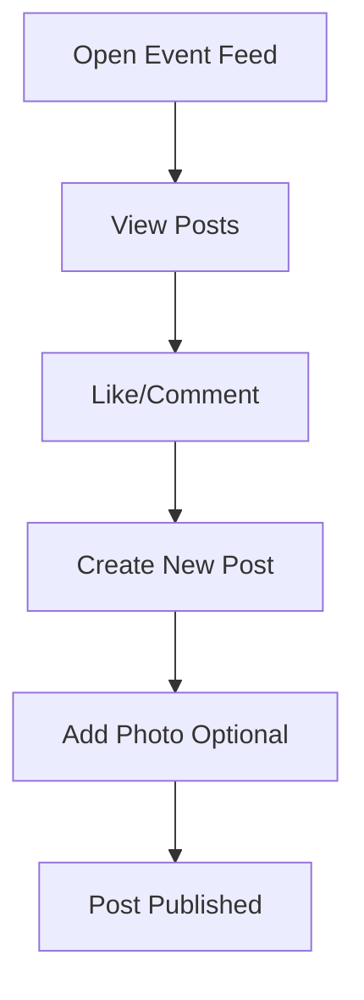

# User Flows

Key user journeys in Press!

## Flow 1: Create Event and Invite Players

**Steps:**
1. Owner opens Press! app
2. Taps "Create Event"
3. Enters name, date, course
4. Selects visibility (Private/Unlisted/Public)
5. Event created, owner redirected to event page
6. Owner copies invite link
7. Shares link via text/email
8. Players tap link, join event
9. Owner approves pending members

## Flow 2: Score Entry During Round

**Steps:**
1. Player opens event from dashboard
2. Navigates to Scorecard tab
3. Selects current hole
4. Enters stroke count using +/- buttons
5. Score auto-saves
6. Repeats for each hole
7. Views running leaderboard

## Flow 3: Create Press During Match

**Steps:**
1. Player views match play game
2. Sees they are 2-down
3. Taps "Press" button
4. Confirms starting hole (current + 1)
5. Confirms stake (defaults to original)
6. Press created as child game
7. Other players see notification

## Flow 4: View Settlement After Round

**Steps:**
1. All scores entered, round complete
2. Admin navigates to Settlement tab
3. Sees payer → payee list
4. Each entry shows Teeth amount
5. Disclaimer visible: "Alligator Teeth are for fun"
6. Can mark settlements as confirmed

## Flow 5: Calcutta Payout Entry

**Steps:**
1. Admin creates calcutta pool
2. Adds items (teams, individuals)
3. After auction, enters winning bids
4. After event, enters finishing positions
5. Taps "Compute Payouts"
6. Views who won what (in Teeth)

## Flow 6: Social Feed Interaction

**Steps:**
1. Player opens event feed
2. Scrolls through posts
3. Likes a post, adds comment
4. Taps compose button
5. Writes post, optionally adds photo
6. Post appears in feed
