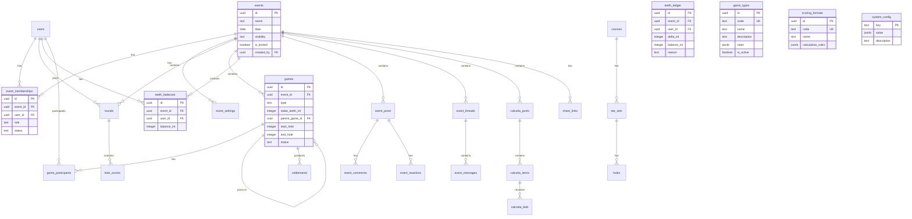

# Schema Overview

## Entity Relationship Diagram



## Table Groups

### Core

| Table | Description |
|-------|-------------|
| `events` | Golf events/tournaments |
| `event_memberships` | User roles within events |
| `event_settings` | Event configuration |

### Courses

| Table | Description |
|-------|-------------|
| `courses` | Golf course definitions (+ source, verified, created_by) |
| `tee_sets` | Tee options for courses (+ color, par, yardage) |
| `holes` | Hole details (par, handicap) |
| `event_tee_snapshot` | Frozen tee data for event |

### Handicaps

| Table | Description |
|-------|-------------|
| `handicap_profiles` | User handicap info (+ source, home_course_id, last_verified_at) |
| `handicap_snapshots` | Frozen handicaps for events |

### Scoring

| Table | Description |
|-------|-------------|
| `rounds` | Player rounds |
| `hole_scores` | Individual hole scores |

### Games & Presses

| Table | Description |
|-------|-------------|
| `games` | Game definitions (presses via parent_game_id) |
| `game_participants` | Players in games |
| `settlements` | Settlement records |
| `settlement_snapshots` | Point-in-time settlement state |

### Alligator Teeth

| Table | Description |
|-------|-------------|
| `teeth_balances` | Current balance (denormalized) |
| `teeth_ledger` | Immutable transaction log |

### Calcutta

| Table | Description |
|-------|-------------|
| `calcutta_pools` | Auction pools |
| `calcutta_items` | Items being auctioned |
| `calcutta_bids` | Winning bids |
| `calcutta_ownership_splits` | Split ownership |
| `calcutta_payouts` | Payout records |

### Social

| Table | Description |
|-------|-------------|
| `event_posts` | Feed posts |
| `event_comments` | Post comments |
| `event_reactions` | Post reactions |
| `event_threads` | Chat threads |
| `event_messages` | Chat messages |
| `media_objects` | Uploaded media |

### Configuration

| Table | Description |
|-------|-------------|
| `game_types` | Available game formats and rules |
| `scoring_formats` | Scoring calculation definitions |
| `system_config` | Global key-value settings |

### System

| Table | Description |
|-------|-------------|
| `share_links` | Public share tokens |
| `audit_log` | Audit trail |

## Key Relationships

### Press Hierarchy

```
games (parent)
  └── games (press 1) via parent_game_id
  └── games (press 2) via parent_game_id
       └── games (press of press) via parent_game_id
```

### Teeth Double-Entry

```
teeth_balances (current state)
  ← Computed from teeth_ledger (immutable log)
```

### Event Visibility

```
events.visibility = PRIVATE  → members only
events.visibility = UNLISTED → leaderboard via share_links
events.visibility = PUBLIC   → leaderboard public
```

## Indexes

Critical indexes for performance:

```sql
-- Membership lookups
CREATE INDEX idx_memberships_event ON event_memberships(event_id);
CREATE INDEX idx_memberships_user ON event_memberships(user_id);

-- Game queries
CREATE INDEX idx_games_event ON games(event_id);
CREATE INDEX idx_games_parent ON games(parent_game_id);

-- Score lookups
CREATE INDEX idx_scores_round ON hole_scores(round_id);

-- Teeth queries
CREATE INDEX idx_teeth_ledger_event_user ON teeth_ledger(event_id, user_id);
CREATE INDEX idx_teeth_balances_event_user ON teeth_balances(event_id, user_id);
```
