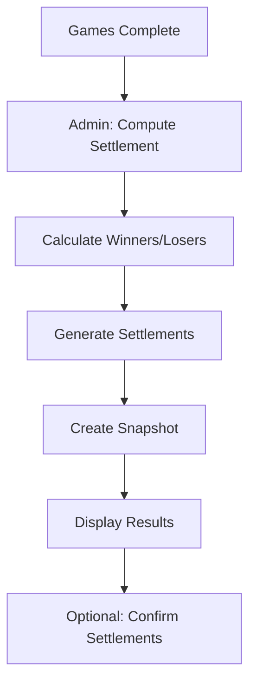

# Settlement

## Overview

Settlement is the process of determining who owes what after games complete. All settlements are in Alligator Teeth.

## Settlement Flow



## Settlement Computation

### Match Play

```typescript
function computeMatchPlaySettlement(game: Game, scores: HoleScore[]) {
  // Count holes won by each player
  const results = calculateMatchPlayResults(game, scores);

  // Winner gets stake * holes_up
  const holesUp = Math.abs(results.playerANet - results.playerBNet);
  const amount = game.stakeTeethInt * holesUp;

  return {
    payerId: results.loser,
    payeeId: results.winner,
    amount,
  };
}
```

### Nassau

```typescript
function computeNassauSettlement(game: Game, scores: HoleScore[]) {
  const settlements = [];

  // Front 9
  const front = computeMatchPlaySettlement({
    ...game,
    startHole: 1,
    endHole: 9,
  }, scores);
  if (front) settlements.push(front);

  // Back 9
  const back = computeMatchPlaySettlement({
    ...game,
    startHole: 10,
    endHole: 18,
  }, scores);
  if (back) settlements.push(back);

  // Overall
  const overall = computeMatchPlaySettlement(game, scores);
  if (overall) settlements.push(overall);

  return settlements;
}
```

### Skins

```typescript
function computeSkinsSettlement(game: Game, scores: HoleScore[]) {
  // Determine skin winners
  const skins = calculateSkins(game, scores);

  // Each skin won = stake amount
  const settlements = [];
  for (const [winnerId, skinCount] of Object.entries(skins)) {
    const amount = skinCount * game.stakeTeethInt;
    // Collect from all other players proportionally
    // ...
  }

  return settlements;
}
```

## Data Model

### Settlement Record

```typescript
interface Settlement {
  id: string;
  eventId: string;
  gameId: string;
  payerId: string;
  payeeId: string;
  amountInt: number;  // Alligator Teeth
  status: 'pending' | 'confirmed';
  createdAt: string;
}
```

### Settlement Snapshot

Point-in-time capture:

```typescript
interface SettlementSnapshot {
  id: string;
  eventId: string;
  computedAt: string;
  data: Settlement[];  // JSON snapshot
}
```

## Compute Settlement RPC

```sql
CREATE OR REPLACE FUNCTION rpc_compute_settlement(p_event_id UUID)
RETURNS JSONB AS $$
DECLARE
  v_settlements JSONB;
  v_snapshot_id UUID;
BEGIN
  -- Check permissions
  IF NOT is_event_member(p_event_id, 'ADMIN') THEN
    RAISE EXCEPTION 'Forbidden';
  END IF;

  -- Calculate all game settlements
  -- (implementation details...)

  -- Create snapshot
  INSERT INTO settlement_snapshots (event_id, data)
  VALUES (p_event_id, v_settlements)
  RETURNING id INTO v_snapshot_id;

  -- Upsert settlement records
  -- (implementation details...)

  -- Audit log
  INSERT INTO audit_log (event_id, user_id, action, entity_type, entity_id)
  VALUES (p_event_id, auth.uid(), 'compute_settlement', 'event', p_event_id);

  RETURN jsonb_build_object(
    'snapshot_id', v_snapshot_id,
    'settlements', v_settlements
  );
END;
$$ LANGUAGE plpgsql SECURITY DEFINER;
```

## UI Components

### Settlement Page

Shows:
- Settlement summary (net positions)
- Payer → Payee list
- Amount per settlement (in Teeth)
- Disclaimer

### Settlement Ledger

Table format:
```
Payer       →  Payee         Amount      Game
Casey       →  Blake         15 Teeth    Match Play
Dana        →  Alex          10 Teeth    Press #1
Blake       →  Dana           5 Teeth    Skins
```

### Compute Button

- Only visible to admin
- Shows "Recompute" if already computed
- Confirms before overwriting

## Disclaimer

**REQUIRED on all settlement displays:**

```
⚠️ Alligator Teeth are for fun and have no cash value.
```

## Net Position View

Aggregates all settlements to show net:

```
Net Positions:
Alex:  +25 Teeth
Blake: +10 Teeth
Casey: -20 Teeth
Dana:  -15 Teeth
```

## Confirmation Flow (Optional)

Settlements can be marked as confirmed:
- Payer confirms they've "paid"
- Payee confirms they've "received"
- Status updates to 'confirmed'

Note: Since Alligator Teeth are for fun, this is just tracking, not actual payment.
